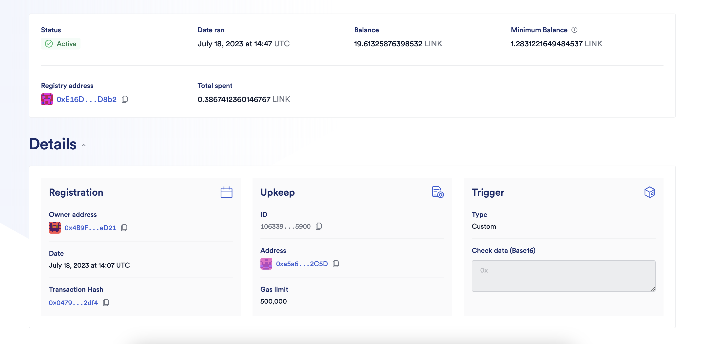
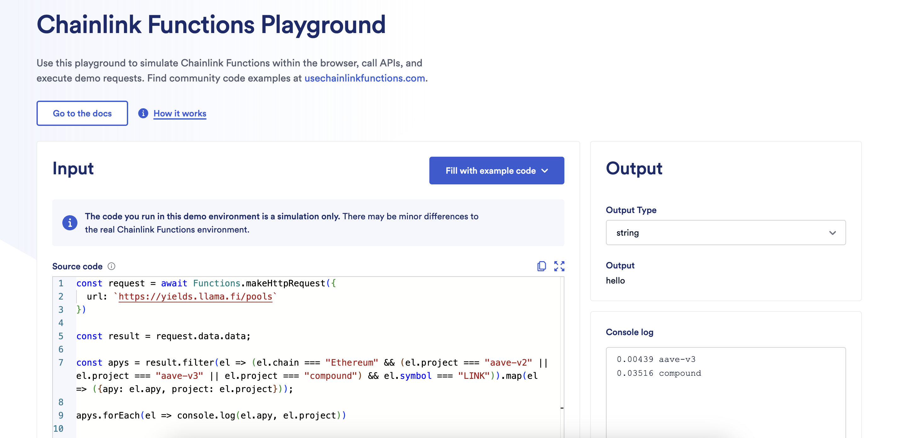
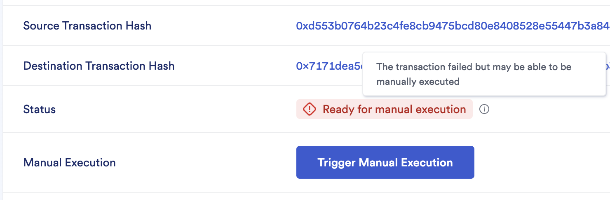
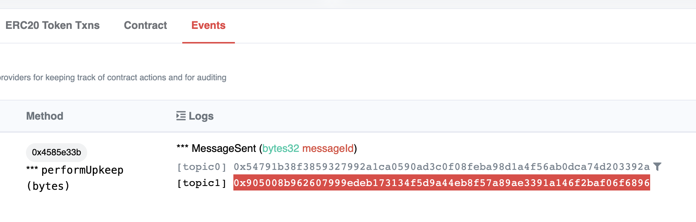

# CCIP Liquidation Protector

> **Note**
>
> _This repository represents an example of using a Chainlink product or service. It is provided to help you understand how to interact with Chainlink’s systems so that you can integrate them into your own. This template is provided "AS IS" without warranties of any kind, has not been audited, and may be missing key checks or error handling to make the usage of the product more clear. Take everything in this repository as an example and not something to be copy pasted into a production ready service._

This project demonstrates how to automate preventing DeFi liquidations & optimizing interest rates on multiple blockchains using Chainlink CCIP, Chainlink Automation and Chainlink Functions.

## Prerequisites

- [Git](https://git-scm.com/book/en/v2/Getting-Started-Installing-Git)
- [Current LTS Node.js version](https://nodejs.org/en/about/releases/)

Verify installation by typing:

```shell
node -v
```

and

```shell
npm -v
```

## Getting Started

1. Install packages

```
npm install
```

2. Compile contracts

```
npx hardhat compile
```

## What is Chainlink CCIP?

**Chainlink Cross-Chain Interoperability Protocol (CCIP)** provides a single, simple, and elegant interface through which dApps and web3 entrepreneurs can securely meet all their cross-chain needs, including token transfers and arbitrary messaging.


With Chainlink CCIP, one can:

- Transfer supported tokens
- Send messages (any data)
- Send messages and tokens

CCIP receiver can be:

- Smart contract that implements `CCIPReceiver.sol`
- EOA

**Note**: If you send a message and token(s) to EOA, only tokens will arrive

To use this project, you can consider CCIP as a "black-box" component and be aware of the Router contract only. If you want to dive deep into it, check the [Official Chainlink Documentation](https://docs.chain.link/ccip).

## What are we building?

Managing multiple DeFi positions is hard. Managing multiple DeFi positions on multiple protocols is even harder. Managing multiple DeFi positions across multiple blockchains was impossible. Until now! Meet the cross-chain liquidation protection and interest rate optimizer powered by Chainlink CCIP.

> **Note**
> This project is for educational purposes only and is not ready for production usage.

End-user has debt positions on multiple protocols/chains (e.g. Benqi on Avalanche, Compound on Polygon, etc…).
They keep all their liquidity safely in a vault on one chain (e.g. Aave on Ethereum).
On each chain where the user has a debt position (e.g. Avalanche and Polygon), Automation monitors the debt ratio.
If Automation detects that any of their loans approaches the liquidation threshold (e.g. Benqi on Avalanche), then Automation sends a CCIP message to the user’s liquidity chain (e.g. Ethereum) to request remediating action (Send funds. Fast!).

When the user’s contract on the liquidity chain receives the CCIP message, it withdraws liquidity from Aave and sends a new CCIP message back to Avalanche with the funds.
That message includes enough information and tokens to fund the right position and avoid liquidation.

Result: The User can have debt positions on multiple chains while still keeping liquidity on a single chain.

The User needs to:
Deploy a liquidation protection smart contract (LPSC) on the liquidity chain.
Create an Automation job on each chain where they have debt, by deploying the Monitor contract.

Optionally the User can run a Functions job with JavaScript that checks interest rates on all major lending protocols on all chains, using the `executeRequest` function of the LPSC smart contract. If it detects that the User is overpaying interest, it will try to pay back the loan and refinance somewhere else.

There is only one liquidity chain on which we are deploying the LPSC. It is set by default to `ethereumSepolia` but you can change it by adjusting the `defaultNetwork` property of the `config` object in the `hardhat.config.ts` file:

```ts
const config: HardhatUserConfig = {
  defaultNetwork: 'ethereumSepolia', // Liquidity Chain
  ...
}
```

## Usage

There are several Hardhat tasks available for deployment and interaction with this project. But before that, you need to set up some environment variables.

We are going to use the [`@chainlink/env-enc`](https://www.npmjs.com/package/@chainlink/env-enc) package for extra security. It encrypts sensitive data instead of storing them as plain text in the `.env` file, by creating a new, `.env.enc` file. Although it's not recommended to push this file online, if that accidentally happens your secrets will still be encrypted.

1. Set a password for encrypting and decrypting the environment variable file. You can change it later by typing the same command.

```shell
npx env-enc set-pw
```

2. Now set the following environment variables: `PRIVATE_KEY`, Source Blockchain RPC URL, Destination Blockchain RPC URL. You can see available options in the `.env.example` file:

```shell
PRIVATE_KEY=""
ETHEREUM_SEPOLIA_RPC_URL=""
OPTIMISM_GOERLI_RPC_URL=""
ARBITRUM_TESTNET_RPC_URL=""
AVALANCHE_FUJI_RPC_URL=""
POLYGON_MUMBAI_RPC_URL=""
```

To set these variables, type the following command and follow the instructions in the terminal:

```shell
npx env-enc set
```

After you are done, the `.env.enc` file will be automatically generated.

If you want to validate your inputs you can always run the next command:

```shell
npx env-enc view
```

### Preparing the mock scenario

To test this project before the actual usage, there are a couple of mock contracts, the two most notable are [`MockVault.sol`](./contracts/mocks/MockVault.sol) and [`MockLending.sol`](./contracts/mocks/MockLending.sol). MockVault represents the protocol on the liquidity chain where the User stores its funds such as Aave for example, while MockLending represents a protocol on other chains where the User can open debt positions, such as Aave, Compound, Benqi and such.

1. To deploy the [`MockVault.sol`](./contracts/mocks/MockVault.sol) smart contract you can use the `deploy-mock-vault` task, by running:

```shell
npx hardhat deploy-mock-vault
```

2. To deploy the [`MockLending.sol`](./contracts/mocks/MockLending.sol) smart contract you can use the `deploy-mock-lending` task, by running:

```shell
npx hardhat deploy-mock-lending --network <NETWORK>
```

Where <NETWORK> can be:

- ethereumSepolia
- polygonMumbai
- optimismGoerli
- arbitrumTestnet
- avalancheFuji

### Deployment

3. To deploy the [`LPSC.sol`](./contracts/LPSC.sol) smart contract you can use the `deploy-lpsc` task:

```shell
npx hardhat deploy-lpsc
--router <CCIP_ROUTER_ADDRESS>
--vault <VAULT_CONTRACT_ADDRESS>
```

For example, to deploy the [`LPSC.sol`](./contracts/LPSC.sol) smart contract to the Liquidity Chain (`defaultNetwork: 'ethereumSepolia'`) run:

```shell
npx hardhat deploy-lpsc --router 0xD0daae2231E9CB96b94C8512223533293C3693Bf --vault <MOCK_VAULT_ADDRESS>
```

4. To deploy the [`MonitorMockLending.sol`](./contracts/monitors/MonitorMockLending.sol) smart contract you can use `deploy-monitor-mock-lending` task:

```shell
npx hardhat deploy-monitor-mock-lending
--min-health-factor <MIN_HEALTH_FACTOR_BEFORE_LIQUIDATION_SAVING_IS_TRIGGERED>
--router <CCIP_ROUTER_ADDRESS>
--lending-address <MOCK_LENDING_ADDRESS>
--token-address <REPAY_TOKEN_ADDRESS>
--on-behalf-of <YOUR_EOA_ADDRESS>
--lpsc <LPSC_CONTRACT_ADDRESS>
--liquidation-chain-selector <LIQUIDATION_CHAIN_SELECTOR>
--link <LINK_TOKEN_ADDRESS> # Optional
```

### Fee Management

5. Chainlink CCIP fees are being paid in LINK tokens. Contracts that send CCIP Cross-Chain Messages need to be funded. In our project, those are [`LPSC.sol`](./contracts/LPSC.sol) and each of the Monitor contracts deployed. To fund them you can either manually send LINK tokens to their addresses from your wallet or use the `fund` task:

```shell
npx hardhat fund
--receiver <RECEIVER_CONTRACT_ADDRESS>
--amount <AMOUNT_IN_JUELS_TO_SEND>
--link <LINK_TOKEN_ADDRESS> # Optional
```

For example, to fund the [`LPSC.sol`](./contracts/LPSC.sol) smart contract with 0.1 Sepolia LINK, run:

```shell
npx hardhat fund --receiver <LPSC_CONTRACT_ADDRESS> --amount 100000000000000000
```

To fund the [`MonitorMockLending.sol`](./contracts/monitors/MonitorMockLending.sol) smart contract with 0.1 Fuji LINK, run:

```shell
npx hardhat fund --receiver <MONITOR_MOCK_LENDING_CONTRACT_ADDRESS> --amount 100000000000000000 --network avalancheFuji
```

### Triggering Liquidation Saving

6. Register a Custom Logic [Chainlink Automation](https://chain.link/automation) Upkeep by following the [guide from the Official Chainlink Documentation](https://docs.chain.link/chainlink-automation/register-upkeep)



Since all Monitors contracts are Chainlink Automation Compatible, once that is set up, it will start monitoring if any positions need to be saved from liquidation, and you can sit back and relax since from that moment the project is officially set up to auto-pilot mode.

For the purpose of testing, you can manually trigger the mock liquidation-saving process, by running the following command:

```shell
npx hardhat trigger --monitor <MONITOR_MOCK_LENDING_CONTRACT_ADDRESS> --network avalancheFuji
```

### Triggering Interest Rate Optimizing

7. Optionally, you can move your funds on the liquidation chain from one protocol to another using [Chainlink Functions](https://chain.link/functions)

To simulate doing that, run the following command:

```shell
npx hardhat functions-simulate --network hardhat
```

To expand this functionality to multiple chains, to find better yield resources, or to add more features, use the [Chainlink Functions Playground](https://functions.chain.link/playground) for the development of the JavaScript code of [`Functions-request-source.js`](./Functions-request-source.js) file.



### Troubleshooting

There is always a possibility that this fully automated process throws an error, most likely because you don't have enough funds to perform the liquidation saving. If that happens, don't panic, LPSC has a system to trigger certain actions manually from the `owner` account.

Most likely, the failure is because you are low on liquidity to cover debt(s), but there are other possible errors. Once you figure out the cause of failure & fix it, you have two options to manually complete the execution:

#### Option 1)

Go to [CCIP Explorer](https://ccip.chain.link/), search for a failed transaction, connect your wallet and click the 'Trigger Manual Execution' button.



#### Option 2)

Navigate to the 'Source Transaction Hash' from the [CCIP Explorer](https://ccip.chain.link/) and try to locate the CCIP Message ID from the event logs



And then call the `reply()` function on the [`LPSC.sol`](./contracts/LPSC.sol) smart contract, using the `reply` task:

```shell
npx hardhat reply
--lpsc <LPSC_ADDRESS_ON_SEPOLIA>
--requested-token-address <REQUESTED_TOKEN_ADDRESS_ON_SOURCE_CHAIN> # Avalanche Fuji in our example
--amount <AMOUNT_REQUESTED>
--source-chain-selector <SOURCE_CHAIN_CHAIN_SELECTOR> # 14767482510784806043 for Avalanche Fuji in our example
--monitor-address <MONITOR_BOT_ADDRESS_ON_SOURCE_CHAIN>
--message-id <ID_OF_THE_CCIP_MESSAGE_THAT_FAILED_TO_EXECUTE_ON_SEPOLIA> # from the logs
```

To manually trigger it for our mock example, run:

```shell
npx hardhat reply --lpsc <LPSC_ADDRESS> --requested-token-address 0xD21341536c5cF5EB1bcb58f6723cE26e8D8E90e4 --amount 1000000000000000000 --source-chain-selector 14767482510784806043 --monitor-address <MONITOR_MOCK_LENDING_ADDRESS> --message-id <CCIP_MESSAGE_ID>
```

Where [0xD21341536c5cF5EB1bcb58f6723cE26e8D8E90e4](https://testnet.snowtrace.io/address/0xD21341536c5cF5EB1bcb58f6723cE26e8D8E90e4) is the CCIP_BnM token address on Avalanche Fuji blockchain.

### Monitor Bots

Other monitor bot smart contracts can be deployed and configured using Chainlink Automation. Currently available are:

- [`MonitorAaveV2`](./contracts/monitors/MonitorAaveV2.sol)
- [`MonitorAaveV3`](./contracts/monitors/MonitorAaveV3.sol)
- [`MonitorCompoundV2`](./contracts/monitors/MonitorCompoundV2.sol)
- [`MonitorCompoundV3`](./contracts/monitors/MonitorCompoundV3.sol)
